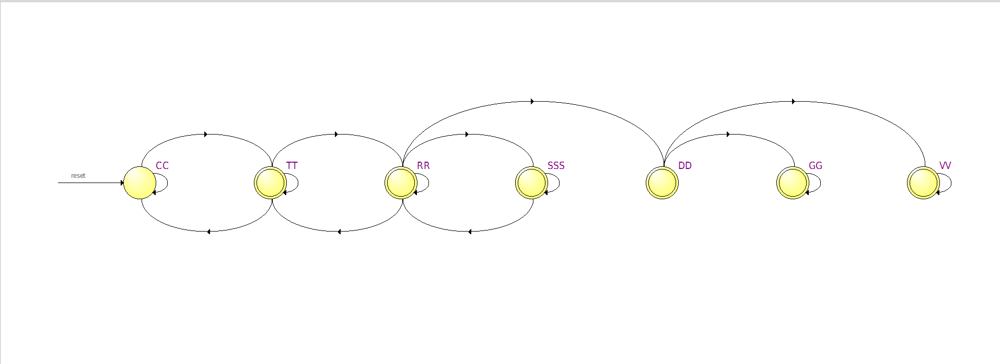
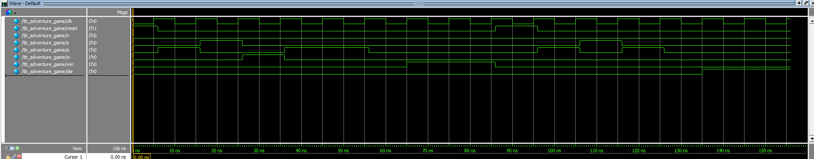

# ELE432 Preliminary Work 1: Adventure Game FSM

This repository contains the SystemVerilog implementation of a hardware-based adventure game, designed for the ELE432 Advanced Digital Design Laboratory at Hacettepe University.

## Overview
The project implements a 7-room adventure game. The architecture is built upon two distinct, communicating Finite State Machines (FSMs):
* **Room FSM:** Tracks the player's location and handles room transitions based on directional inputs (N, S, E, W).
* **Sword FSM:** Tracks whether the player has acquired the required sword to safely pass the Dragon's Den and win the game.

## Verification & Synthesis
The design was synthesized using Quartus Prime and behaviorally simulated using Questa. A self-checking testbench was developed to automatically apply directional inputs and verify both the Win and Die scenarios.

### RTL Schematic (Room FSM)
*The hardware logic extracted by the Quartus Prime RTL Viewer, confirming the state machine architecture.*

### Simulation Waveforms
*Questa simulation results displaying the self-checking testbench routing the player through the winning and dying paths.*

---
**Author:** Efe Erdi